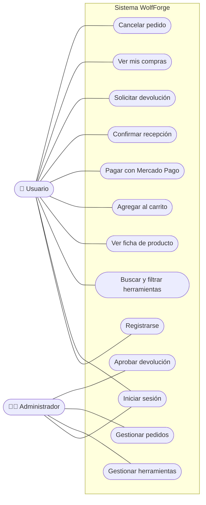

# Diagrama de Casos de Uso — WolfForge

```mermaid
flowchart LR
  Usuario(["🧑 Usuario"])
  Admin(["🧑‍💼 Administrador"])

  subgraph Sistema["Sistema WolfForge"]
    UC1(["Registrarse"])
    UC2(["Iniciar sesión"])
    UC3(["Buscar y filtrar herramientas"])
    UC4(["Ver ficha de producto"])
    UC5(["Agregar al carrito"])
    UC6(["Pagar con Mercado Pago"])
    UC7(["Confirmar recepción"])
    UC8(["Solicitar devolución"])
    UC9(["Ver mis compras"])
    UC10(["Gestionar herramientas"])
    UC11(["Gestionar pedidos"])
    UC12(["Aprobar devolución"])
    UC13(["Cancelar pedido"])
  end

  Usuario --- UC1
  Usuario --- UC2
  Usuario --- UC3
  Usuario --- UC4
  Usuario --- UC5
  Usuario --- UC6
  Usuario --- UC7
  Usuario --- UC8
  Usuario --- UC9
  Usuario --- UC13
  Admin --- UC2
  Admin --- UC10
  Admin --- UC11
  Admin --- UC12
```

*Actores: Usuario (cliente autenticado) y Administrador. Ambos pueden iniciar sesión; el resto de las acciones son exclusivas de cada rol.*
