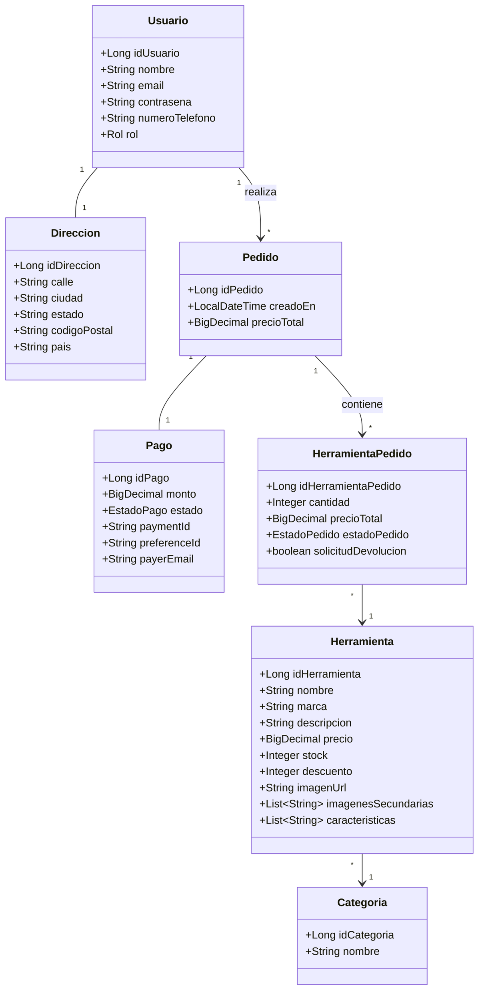

# Diagrama de Clases — Modelo de Entidades

```mermaid
classDiagram
  class Usuario {
    +Long idUsuario
    +String nombre
    +String email
    +String contrasena
    +String numeroTelefono
    +Rol rol
  }
  class Direccion {
    +Long idDireccion
    +String calle
    +String ciudad
    +String estado
    +String codigoPostal
    +String pais
  }
  class Pedido {
    +Long idPedido
    +LocalDateTime creadoEn
    +BigDecimal precioTotal
  }
  class Pago {
    +Long idPago
    +BigDecimal monto
    +EstadoPago estado
    +String paymentId
    +String preferenceId
    +String payerEmail
  }
  class Categoria {
    +Long idCategoria
    +String nombre
  }
  class HerramientaPedido {
    +Long idHerramientaPedido
    +Integer cantidad
    +BigDecimal precioTotal
    +EstadoPedido estadoPedido
    +boolean solicitudDevolucion
  }
  class Herramienta {
    +Long idHerramienta
    +String nombre
    +String marca
    +String descripcion
    +BigDecimal precio
    +Integer stock
    +Integer descuento
    +String imagenUrl
    +List~String~ imagenesSecundarias
    +List~String~ caracteristicas
  }

  Usuario "1" -- "1" Direccion
  Usuario "1" --> "*" Pedido : realiza
  Pedido "1" -- "1" Pago
  Pedido "1" --> "*" HerramientaPedido : contiene
  HerramientaPedido "*" --> "1" Herramienta
  Herramienta "*" --> "1" Categoria
```

*Un Pedido agrupa varias HerramientaPedido (una por producto comprado); cada una referencia a la Herramienta real y mantiene su propio estado.*
