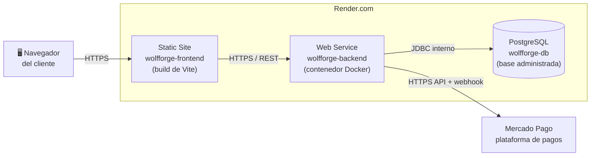

# Diagrama de Despliegue — Render

```mermaid
flowchart LR
  Navegador["🖥️ Navegador<br/>del cliente"] -->|HTTPS| Static["Static Site<br/>wolfforge-frontend<br/>(build de Vite)"]
  subgraph Render["Render.com"]
    Static -->|HTTPS / REST| Web["Web Service<br/>wolfforge-backend<br/>(contenedor Docker)"]
    Web -->|JDBC interno| DB[("PostgreSQL<br/>wolfforge-db<br/>(base administrada)")]
  end
  Web -->|HTTPS API + webhook| MP["Mercado Pago<br/>plataforma de pagos"]
```

*Blueprint definido en render.yaml: 3 servicios conectados entre sí, con HTTPS de punta a punta.*
