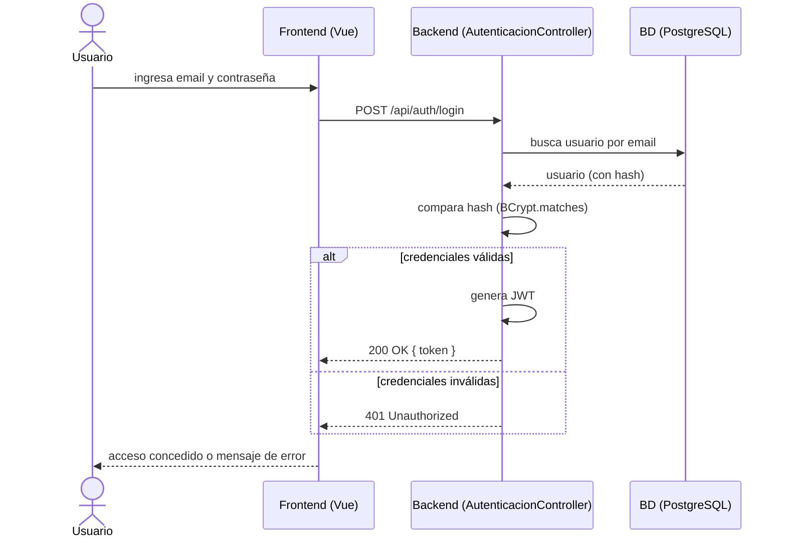

# Diagrama de Secuencia — Inicio de Sesión

```mermaid
sequenceDiagram
  actor Usuario
  participant Frontend as Frontend (Vue)
  participant Backend as Backend (AutenticacionController)
  participant BD as BD (PostgreSQL)

  Usuario->>Frontend: ingresa email y contraseña
  Frontend->>Backend: POST /api/auth/login
  Backend->>BD: busca usuario por email
  BD-->>Backend: usuario (con hash)
  Backend->>Backend: compara hash (BCrypt.matches)
  alt credenciales válidas
    Backend->>Backend: genera JWT
    Backend-->>Frontend: 200 OK { token }
  else credenciales inválidas
    Backend-->>Frontend: 401 Unauthorized
  end
  Frontend-->>Usuario: acceso concedido o mensaje de error
```

*La contraseña nunca viaja ni se compara en texto plano: se compara el hash BCrypt almacenado contra el ingresado.*
