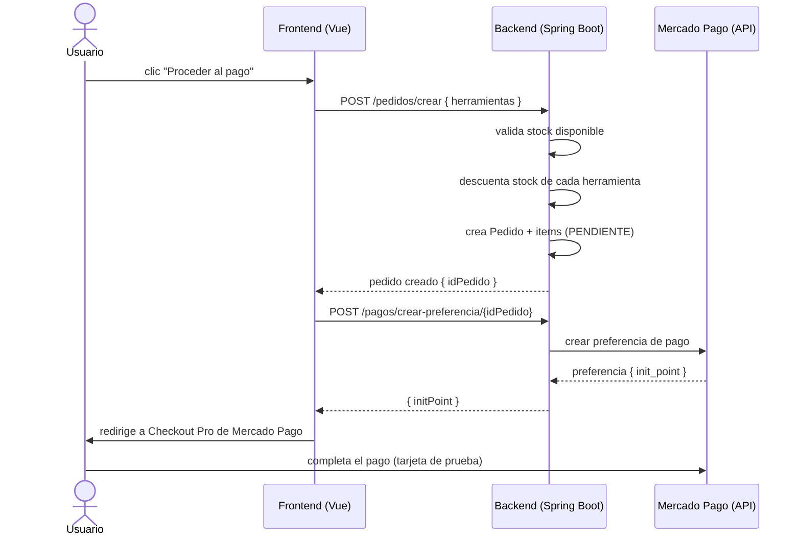

# Diagrama de Secuencia — Crear Pedido y Pagar

```mermaid
sequenceDiagram
  actor Usuario
  participant Frontend as Frontend (Vue)
  participant Backend as Backend (Spring Boot)
  participant MP as Mercado Pago (API)

  Usuario->>Frontend: clic "Proceder al pago"
  Frontend->>Backend: POST /pedidos/crear { herramientas }
  Backend->>Backend: valida stock disponible
  Backend->>Backend: descuenta stock de cada herramienta
  Backend->>Backend: crea Pedido + items (PENDIENTE)
  Backend-->>Frontend: pedido creado { idPedido }
  Frontend->>Backend: POST /pagos/crear-preferencia/{idPedido}
  Backend->>MP: crear preferencia de pago
  MP-->>Backend: preferencia { init_point }
  Backend-->>Frontend: { initPoint }
  Frontend->>Usuario: redirige a Checkout Pro de Mercado Pago
  Usuario->>MP: completa el pago (tarjeta de prueba)
```

*El pedido se crea en estado PENDIENTE antes de ir a pagar; el stock se descuenta en ese momento (al crear el pedido), no al confirmar el pago.*
