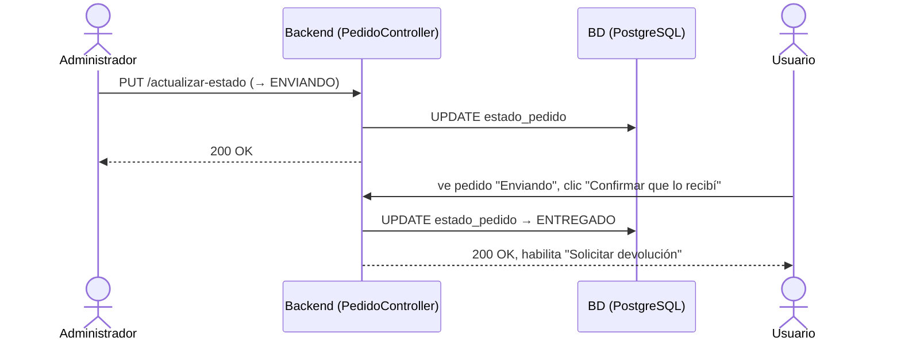

# Diagrama de Secuencia — Ciclo de Vida del Pedido (Entrega)

```mermaid
sequenceDiagram
  actor Administrador
  participant Backend as Backend (PedidoController)
  participant BD as BD (PostgreSQL)
  actor Usuario

  Administrador->>Backend: PUT /actualizar-estado (→ ENVIANDO)
  Backend->>BD: UPDATE estado_pedido
  Backend-->>Administrador: 200 OK

  Usuario->>Backend: ve pedido "Enviando", clic "Confirmar que lo recibí"
  Backend->>BD: UPDATE estado_pedido → ENTREGADO
  Backend-->>Usuario: 200 OK, habilita "Solicitar devolución"
```

*El pedido pasa de CONFIRMADO a ENVIANDO (admin) y de ENVIANDO a ENTREGADO (usuario), cada parte confirma su propio paso.*
