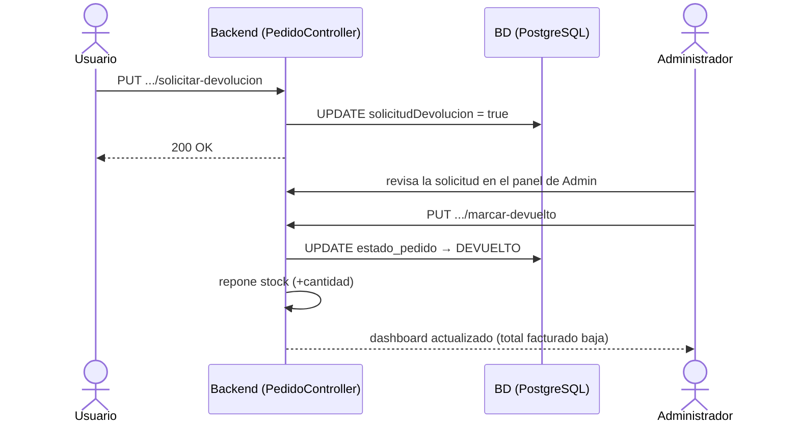

# Diagrama de Secuencia — Solicitar y Aprobar Devolución

```mermaid
sequenceDiagram
  actor Usuario
  participant Backend as Backend (PedidoController)
  participant BD as BD (PostgreSQL)
  actor Administrador

  Usuario->>Backend: PUT .../solicitar-devolucion
  Backend->>BD: UPDATE solicitudDevolucion = true
  Backend-->>Usuario: 200 OK

  Administrador->>Backend: revisa la solicitud en el panel de Admin
  Administrador->>Backend: PUT .../marcar-devuelto
  Backend->>BD: UPDATE estado_pedido → DEVUELTO
  Backend->>Backend: repone stock (+cantidad)
  Backend-->>Administrador: dashboard actualizado (total facturado baja)
```

*Aprobar la devolución repone el stock automáticamente y descuenta el monto del total facturado en el dashboard del admin.*
