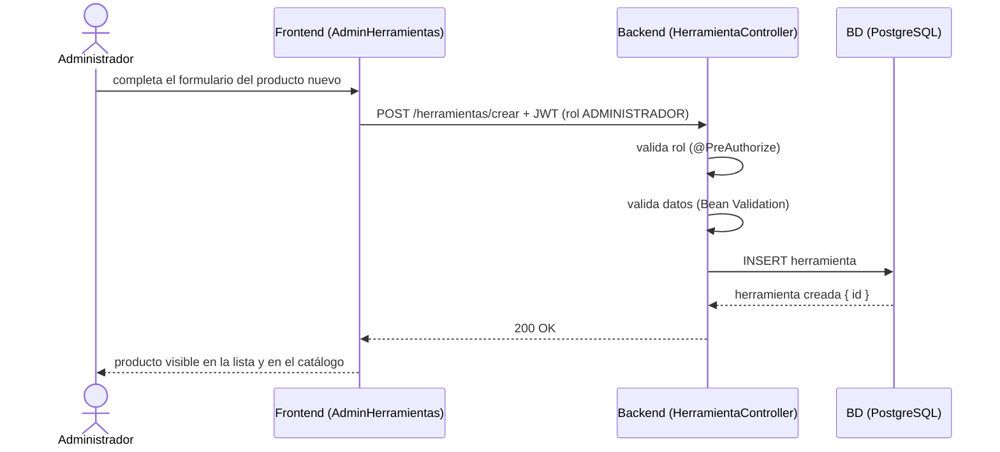

# Diagrama de Secuencia — Alta de Herramienta (Admin)

```mermaid
sequenceDiagram
  actor Administrador
  participant Frontend as Frontend (AdminHerramientas)
  participant Backend as Backend (HerramientaController)
  participant BD as BD (PostgreSQL)

  Administrador->>Frontend: completa el formulario del producto nuevo
  Frontend->>Backend: POST /herramientas/crear + JWT (rol ADMINISTRADOR)
  Backend->>Backend: valida rol (@PreAuthorize)
  Backend->>Backend: valida datos (Bean Validation)
  Backend->>BD: INSERT herramienta
  BD-->>Backend: herramienta creada { id }
  Backend-->>Frontend: 200 OK
  Frontend-->>Administrador: producto visible en la lista y en el catálogo
```

*El mismo endpoint que usa este flujo es el que se probó en vivo al cargar el Medidor Láser Bosch GLM 30-23.*
