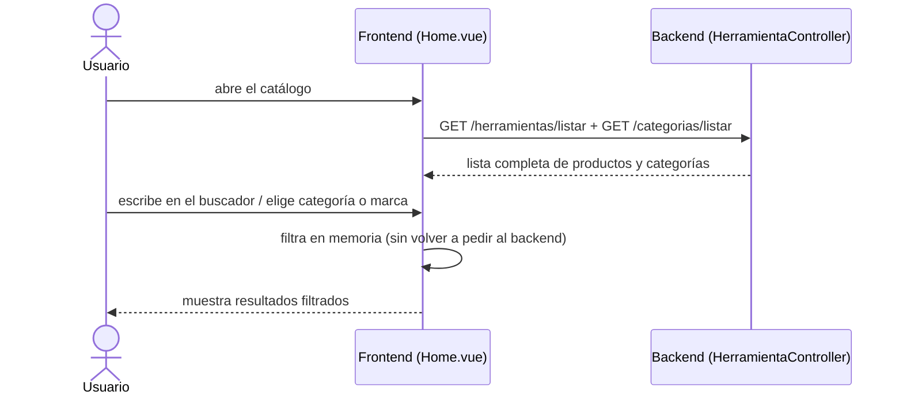

# Diagrama de Secuencia — Búsqueda y Filtrado del Catálogo

```mermaid
sequenceDiagram
  actor Usuario
  participant Frontend as Frontend (Home.vue)
  participant Backend as Backend (HerramientaController)

  Usuario->>Frontend: abre el catálogo
  Frontend->>Backend: GET /herramientas/listar + GET /categorias/listar
  Backend-->>Frontend: lista completa de productos y categorías
  Usuario->>Frontend: escribe en el buscador / elige categoría o marca
  Frontend->>Frontend: filtra en memoria (sin volver a pedir al backend)
  Frontend-->>Usuario: muestra resultados filtrados
```

*El filtrado es 100% client-side sobre los datos ya cargados: no hay ida y vuelta al servidor por cada tecla o filtro que se cambia.*
