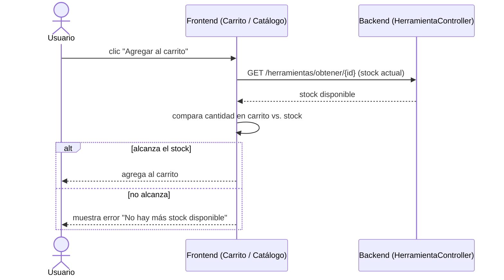

# Diagrama de Secuencia — Validación de Stock al Agregar al Carrito

```mermaid
sequenceDiagram
  actor Usuario
  participant Frontend as Frontend (Carrito / Catálogo)
  participant Backend as Backend (HerramientaController)

  Usuario->>Frontend: clic "Agregar al carrito"
  Frontend->>Backend: GET /herramientas/obtener/{id} (stock actual)
  Backend-->>Frontend: stock disponible
  Frontend->>Frontend: compara cantidad en carrito vs. stock
  alt alcanza el stock
    Frontend-->>Usuario: agrega al carrito
  else no alcanza
    Frontend-->>Usuario: muestra error "No hay más stock disponible"
  end
```

*El stock se revalida contra el backend en cada intento de agregar, no solo una vez al cargar la página del catálogo.*
